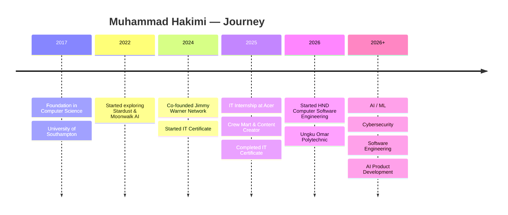

<p align="center">
  
</p>

<h1 align="center">Hi, I'm Muhammad Hakimi 👋</h1>

<p align="center">
  
</p>

<p align="center">
  <i>I build intelligent systems and practical software that solve real-world problems.</i>
</p>

<p align="center">
  <i>Interested in AI, machine learning, cybersecurity, software engineering, robotics, and emerging technologies.</i>
</p>

<p align="center">
  <a href="https://www.linkedin.com/in/muhammad-hakimi-b7a906297">
    
  </a>
  <a href="https://github.com/JimmyWarner9">
    
  </a>
  <a href="https://jimmywarner9.github.io/Bilik-Digital-360/">
    
  </a>
</p>

---

# 🚀 Now

### 🏢 Co-Founder — Jimmy Warner Network

Building and exploring products around:

* 🤖 Artificial Intelligence
* 🧠 Machine Learning
* 🛡️ Cybersecurity
* 💻 Software Engineering
* ⚙️ Automation
* 🌐 Digital Products

### 🎓 Studying

**HND Computer Software Engineering**
Ungku Omar Polytechnic · 2026–2028

### 🔨 Currently Building

* 🍛 [Pakdin Dalca](https://github.com/JimmyWarner9/pakdindalca)
* ☕ [Carmila Cafe](https://github.com/JimmyWarner9/CarmilaCafe)
* 🤖 [AI Startup Investor Page](https://github.com/JimmyWarner9/ai-startup-investor-page)
* 🏠 [360° Digital Room](https://jimmywarner9.github.io/Bilik-Digital-360/)

### 💼 Open To

* AI / ML opportunities
* Software engineering opportunities
* Cybersecurity projects
* AI startup collaborations
* Open-source projects
* Web development projects
* Research and technology collaborations

---

# 🧠 About Me

I'm a Computer Software Engineering student interested in building software that goes beyond the screen.

My main interests are **Artificial Intelligence, Machine Learning, Cybersecurity, Software Engineering, Robotics, Networking, and emerging technologies**.

I enjoy taking an idea from:

```text
Idea
  ↓
Research
  ↓
Design
  ↓
Development
  ↓
Testing
  ↓
Deployment
  ↓
Real-World Use
```

I also enjoy building software for real businesses. Projects such as restaurant and cafe websites have helped me understand that good software isn't only about code — it's also about the people who use it.

My long-term goal is to build intelligent products that combine **AI, software engineering, automation, and cybersecurity**.

---

# 🧠 AI / ML

I'm currently developing my knowledge in:

* 🤖 Machine Learning
* 🧠 Artificial Intelligence
* 📊 Data Modeling
* 👁️ Computer Vision
* 🎮 Game AI
* ⚙️ AI Automation
* 🧩 Neural Networks
* 🔬 AI Research
* 🚀 AI Product Development

### Areas I want to explore

```text
Artificial Intelligence
        │
        ├── Machine Learning
        │      ├── Supervised Learning
        │      ├── Unsupervised Learning
        │      └── Model Development
        │
        ├── Computer Vision
        │
        ├── Data Science
        │
        ├── Automation
        │
        └── Intelligent Applications
```

---

# 🛡️ Cybersecurity

I'm interested in using software and AI to improve cybersecurity.

Areas I'm exploring:

* 🔐 Network Security
* 🛡️ Threat Detection
* 🤖 AI-Assisted Security
* 🔎 Security Monitoring
* ⚙️ Security Automation
* ☁️ Cloud Security
* 💻 Secure Software Development
* 🧠 Machine Learning for Security

My interest is particularly focused on how **AI and cybersecurity can work together** to detect and respond to modern threats.

---

# 💻 Tech Stack

### Languages

<p>
  
</p>

### AI / Machine Learning

<p>
  
</p>

**AI & Data**

`PyTorch` · `Machine Learning` · `Data Modeling` · `Game AI` · `Automation`

### Software & Web

<p>
  
</p>

**Software**

`Django` · `JavaScript` · `HTML` · `CSS` · `C` · `C++`

### Cloud & Tools

<p>
  
</p>

**Tools**

`Git` · `GitHub` · `AWS` · `Windows` · `VS Code` · `IntelliJ IDEA` · `Laragon`

---

# 💼 Experience

<details>
<summary><b>Co-Founder — Jimmy Warner Network</b></summary>

**August 2024 – Present**

Working on ideas and projects involving:

* Artificial Intelligence
* Machine Learning
* Cybersecurity
* Software development
* Digital products
* Technology research

</details>

<details>
<summary><b>IT Intern — Acer</b></summary>

**January 2025 – February 2025**

Gained practical experience in an IT environment and developed skills related to technical support, troubleshooting, communication, and workplace processes.

</details>

<details>
<summary><b>Crew Mart & Content Creator — Richiamo Coffee</b></summary>

**April 2025 – August 2025**

Worked with customers, daily operations, inventory, communication, and content-related activities.

</details>

---

# 🎓 Education

### HND Computer Software Engineering

**Ungku Omar Polytechnic**
2026 – 2028

### Certificate in Information Technology

**Kolej Komuniti Gerik**
2024 – 2025

### Foundation in Computer Science

**University of Southampton**
2017 – 2018

---

# 🗺️ My Journey



---

# 🚀 Selected Work

## 🏠 AR 360° Digital Room

**[Explore the 360° Digital Room →](https://jimmywarner9.github.io/Bilik-Digital-360/)**

An interactive digital room experience that allows users to explore a 360° environment through a web browser.

### Features

* 360° environment
* Interactive hotspots
* Navigation
* Information popups
* Digital room exploration
* Browser-based experience
* Mobile-friendly sharing

**Technologies:**
`Pano2VR` · `360° Photography` · `HTML5` · `Canva`

---

## 🤖 Stardust & Moonwalk AI

An AI-focused project exploring the use of Python, data science, machine learning, and intelligent systems.

### Focus

* Machine Learning
* Game AI
* AI for Business
* Data
* Intelligent systems

**Technologies:**
`Python` · `Machine Learning` · `Data Science`

---

## 🍛 Pakdin Dalca

**[View Repository →](https://github.com/JimmyWarner9/pakdindalca)**

A restaurant website designed for **Pak Din Nasi Dalcha**, including menu presentation, catering information, and an online ordering interface.

### Features

* Restaurant landing page
* Menu
* Catering
* Online ordering
* Shopping cart
* WhatsApp order integration
* Responsive design

**Technologies:**
`HTML` · `CSS` · `JavaScript`

---

## ☕ Carmila Cafe

**[View Repository →](https://github.com/JimmyWarner9/CarmilaCafe)**

A modern cafe website focused on brand presentation and menu information.

**Technologies:**
`HTML` · `CSS` · `JavaScript`

---

## 🤖 AI Startup Investor Page

**[View Repository →](https://github.com/JimmyWarner9/ai-startup-investor-page)**

A landing page designed to present an AI startup concept to potential investors.

**Technologies:**
`HTML` · `CSS`

---

# 📊 GitHub Activity

<p align="center">
  
  
</p>

<p align="center">
  
</p>

---

# 📚 Currently Learning

```text
╔══════════════════════════════════════╗
║       CURRENT LEARNING PATH          ║
╠══════════════════════════════════════╣
║                                      ║
║  💻 Software Engineering             ║
║  ├── Programming                     ║
║  ├── Software Architecture           ║
║  └── Application Development         ║
║                                      ║
║  🤖 Artificial Intelligence           ║
║  ├── Machine Learning                ║
║  ├── Data Modeling                   ║
║  └── Computer Vision                 ║
║                                      ║
║  🛡️ Cybersecurity                    ║
║  ├── Network Security                ║
║  ├── Threat Detection                ║
║  └── Security Automation             ║
║                                      ║
║  ☁️ Cloud                             ║
║  ├── AWS                             ║
║  └── Cloud Applications              ║
║                                      ║
╚══════════════════════════════════════╝
```

---

# 🏆 Highlights

* 🚀 Co-Founder of Jimmy Warner Network
* 🤖 Building AI and software projects
* 🛡️ Exploring AI + Cybersecurity
* 🎓 HND Computer Software Engineering student
* 🌐 Built real-world business websites
* 🏠 Built an interactive 360° digital room
* 💻 Developing software engineering skills
* 🔬 Exploring machine learning and intelligent systems
* 🌍 Interested in emerging technologies

---

# 🐍 Contribution Activity

<p align="center">
  
</p>

---

# 💡 My Development Philosophy

> **Build it. Test it. Improve it. Ship it.**

I believe good software comes from continuous learning, experimentation, and solving real problems.

```text
Learn
  ↓
Build
  ↓
Break
  ↓
Fix
  ↓
Improve
  ↓
Ship
  ↓
Repeat
```

---

# 🎯 What I'm Working Toward

My long-term direction is at the intersection of:

```text
              🤖 AI
               │
               │
       🛡️ Cybersecurity
               │
               │
💻 Software ───┼─── ☁️ Cloud
 Engineering   │
               │
            📊 Data
               │
               │
            🚀 Products
```

I want to continue developing the technical foundation needed to build useful AI-powered software and technology products.

---

# 💼 Open To

I'm interested in connecting with people working on:

* 🤖 AI / Machine Learning
* 💻 Software Engineering
* 🛡️ Cybersecurity
* 🌐 Web Development
* ☁️ Cloud Computing
* 🔬 Technology Research
* 🚀 Startups
* 🌍 Open Source

If you're building something interesting, feel free to connect.

---

# 📬 Let's Connect

<p align="center">

<a href="https://www.linkedin.com/in/muhammad-hakimi-b7a906297">

</a>

<a href="https://github.com/JimmyWarner9">

</a>

<a href="https://jimmywarner9.github.io/Bilik-Digital-360/">

</a>

</p>

---

<p align="center">
  <i>Stay curious. Keep learning. Keep building.</i>
</p>

<p align="center">
  
</p>
