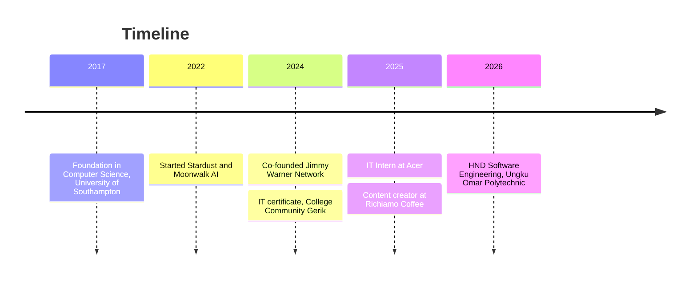

# ***Muhammad Hakimi bin Abdul Malik***

  

  

  <i>I build intelligent systems, and I like making them work in the real world, not just on a slide.</i> 
  <i>I'm a co-founder and AI/ML engineer at Jimmy Warner Network, working across machine learning, computer vision, IoT, and cybersecurity.</i> 
  <i>I also build websites for real businesses, from a nasi dalcha shop to a cafe, because good software starts with the people using it.</i> 
  <i>I'm studying Computer Software Engineering, and every project is another step toward building products that matter.</i> 
  <i>Stay curious, keep shipping, and let the work speak.</i>

  
  

---

## Now

**Co-Founder @ Jimmy Warner Network:** building AI and cybersecurity products, from machine learning and computer vision to IoT.

**Studying:** HND Computer Software Engineering at Ungku Omar Polytechnic (2026 to 2028).

**Building:** [Pakdin Dalca](https://github.com/JimmyWarner9/pakdindalca), [Carmila Cafe](https://github.com/JimmyWarner9/CarmilaCafe), and an [AI startup investor page](https://github.com/JimmyWarner9/ai-startup-investor-page).

**Try it:** an interactive [360° digital room](https://jimmywarner9.github.io/Bilik-Digital-360/) you can explore in the browser.

**Open to:** collaborations, internships, and opportunities in AI, software, and cybersecurity.

---

## About

I'm a co-founder and AI/ML engineer, and a Computer Software Engineering student at Ungku Omar Polytechnic. I co-founded **Jimmy Warner Network** in 2024, a startup focused on AI and cybersecurity. I'm interested in AI, aerospace, networking, and robotics, and I like turning messy requirements into software people can actually use.

<b>Experience</b>

- **Co-Founder**, Jimmy Warner Network (Aug 2024 to now)
- **Crew Mart & Content Creator**, Richiamo Coffee (Apr to Aug 2025)
- **IT Intern**, Acer (Jan to Feb 2025)

<b>Education</b>

- **HND Computer Software Engineering**, Ungku Omar Polytechnic (2026 to 2028)
- **IT Certificate**, College Community Gerik (Aug 2024 to Feb 2025)
- **Foundation in Computer Science**, University of Southampton (2017 to 2018)

## My journey

## Skills

  

**AI & Data:** PyTorch · Data Modeling · Game AI · Robotic Process Automation
**Software & Cloud:** Django · Cloud Computing · AWS IoT · Embedded Software · IntelliJ IDEA
**Systems:** Robot Operating System (ROS) · IoT · Windows · Laragon

---

## Selected work

### [AR 360 Digital Room](https://jimmywarner9.github.io/Bilik-Digital-360/)
An interactive 360° digital room you can explore in the browser.

**AR · 360 Video · Panopto**

---

### Stardust & Moonwalk AI
An AI project from Jimmy Warner Network, built with Python, data science, and machine learning collaborators.

**Game AI · AI for Business**

---

### [Pakdin Dalca](https://github.com/JimmyWarner9/pakdindalca)
Website for Pak Din Nasi Dalcha with a menu, catering page, and an online cart that sends orders through WhatsApp.

**HTML · CSS · JavaScript**

---

### [Carmila Cafe](https://github.com/JimmyWarner9/CarmilaCafe)
Website for a cafe, with menu and brand presentation.

**JavaScript · CSS**

---

### [AI Startup Investor Page](https://github.com/JimmyWarner9/ai-startup-investor-page)
Landing page presenting an AI startup to potential investors.

**HTML · CSS**

