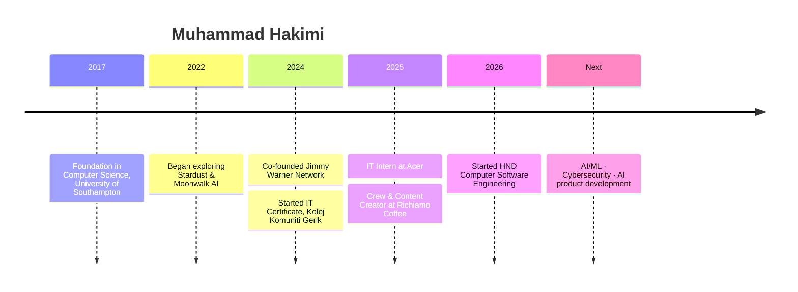

<div align="center">

<table>
<tr>
<td align="center"><br><sub><b>THEN</b> · always curious</sub></td>
<td align="center"><br><sub><b>NOW</b> · still playing, now building</sub></td>
</tr>
</table>

# Muhammad Hakimi

**Co-Founder, Jimmy Warner Network**
*AI · Machine Learning · Cybersecurity · Software Engineering*


<a href="https://www.linkedin.com/in/muhammad-hakimi-b7a906297"></a>
<a href="https://github.com/JimmyWarner9"></a>
<a href="https://jimmywarner9.github.io/Bilik-Digital-360/"></a>

</div>

---<svg xmlns="http://www.w3.org/2000/svg" viewBox="0 0 1600 440" width="1600" height="440" role="img" aria-label="Muhammad Hakimi — Founder · AI/ML · Cybersecurity">
  <defs>
    <linearGradient id="sky" x1="0" y1="0" x2="0" y2="1">
      <stop offset="0" stop-color="#05080f"/>
      <stop offset="0.55" stop-color="#0a1426"/>
      <stop offset="0.85" stop-color="#3a1a10"/>
      <stop offset="1" stop-color="#ff7a1a"/>
    </linearGradient>
    <radialGradient id="glow" cx="0.5" cy="1" r="0.8">
      <stop offset="0" stop-color="#ff8a2a" stop-opacity="0.75"/>
      <stop offset="1" stop-color="#ff8a2a" stop-opacity="0"/>
    </radialGradient>
    <radialGradient id="globe" cx="0.35" cy="0.35" r="0.8">
      <stop offset="0" stop-color="#7a3a14"/>
      <stop offset="0.6" stop-color="#1a0f0b"/>
      <stop offset="1" stop-color="#05070c"/>
    </radialGradient>
    <linearGradient id="orange" x1="0" y1="0" x2="1" y2="0">
      <stop offset="0" stop-color="#ff6a00"/>
      <stop offset="1" stop-color="#ffa43a"/>
    </linearGradient>
    <linearGradient id="shine" x1="0" y1="0" x2="1" y2="0">
      <stop offset="0" stop-color="#fff" stop-opacity="0"/>
      <stop offset="0.5" stop-color="#fff" stop-opacity="0.85"/>
      <stop offset="1" stop-color="#fff" stop-opacity="0"/>
    </linearGradient>
    <filter id="blur" x="-50%" y="-50%" width="200%" height="200%"><feGaussianBlur stdDeviation="6"/></filter>
    <filter id="soft"><feGaussianBlur stdDeviation="1.2"/></filter>
    <clipPath id="globeClip"><circle cx="1450" cy="330" r="190"/></clipPath>
    <clipPath id="titleClip"><rect x="470" y="130" width="790" height="90"/></clipPath>
  </defs>

  <style>
    .h{font-family:'Segoe UI','Helvetica Neue',Arial,'Arial Black',sans-serif;font-weight:900}
    .t-white{font-size:78px;fill:#e9edf5}
    .t-orange{font-size:78px;fill:url(#orange)}
    .sub{font-family:'Segoe UI','Helvetica Neue',Arial,sans-serif;font-weight:600;font-size:26px;fill:#dfe6f2}
    .tag{font-family:'Segoe UI','Helvetica Neue',Arial,sans-serif;font-weight:700;font-size:14px;fill:#e6ebf4}
    .cloud{fill:#0d1626;opacity:.7}
    .drift1{animation:drift 60s linear infinite}
    .drift2{animation:drift 90s linear infinite reverse}
    .stripe{animation:slide 5s ease-in-out infinite alternate}
    .spin{transform-origin:1450px 330px;animation:rot 40s linear infinite}
    .ring{transform-origin:290px 255px;animation:rot 12s linear infinite}
    .ring2{transform-origin:290px 255px;animation:rot 18s linear infinite reverse}
    .pulse{transform-origin:290px 255px;animation:pulse 3s ease-in-out infinite}
    .twinkle{animation:tw 3s ease-in-out infinite}
    .sweep{animation:sweep 6s ease-in-out infinite}
    .flow{stroke-dasharray:6 10;animation:dash 2s linear infinite}
    .fade-in{animation:fadeUp 1.4s ease-out both}
    .horizon{animation:breathe 5s ease-in-out infinite}
    @keyframes drift{from{transform:translateX(0)}to{transform:translateX(-400px)}}
    @keyframes slide{from{transform:translateX(-20px)}to{transform:translateX(40px)}}
    @keyframes rot{to{transform:rotate(360deg)}}
    @keyframes pulse{0%,100%{transform:scale(1);opacity:.5}50%{transform:scale(1.18);opacity:1}}
    @keyframes tw{0%,100%{opacity:.15}50%{opacity:1}}
    @keyframes sweep{0%{transform:translateX(-300px)}60%,100%{transform:translateX(1000px)}}
    @keyframes dash{to{stroke-dashoffset:-32}}
    @keyframes fadeUp{from{opacity:0;transform:translateY(14px)}to{opacity:1;transform:none}}
    @keyframes breathe{0%,100%{opacity:.7}50%{opacity:1}}
    @media (prefers-reduced-motion:reduce){*{animation:none!important}}
  </style>

  <rect width="1600" height="440" fill="url(#sky)"/>

  <g fill="#fff">
    <circle class="twinkle" cx="120" cy="40" r="1.4"/>
    <circle class="twinkle" style="animation-delay:.6s" cx="420" cy="25" r="1.1"/>
    <circle class="twinkle" style="animation-delay:1.2s" cx="760" cy="60" r="1.3"/>
    <circle class="twinkle" style="animation-delay:1.8s" cx="1010" cy="30" r="1.2"/>
    <circle class="twinkle" style="animation-delay:.3s" cx="1210" cy="70" r="1.5"/>
    <circle class="twinkle" style="animation-delay:2.1s" cx="1500" cy="35" r="1.2"/>
    <circle class="twinkle" style="animation-delay:2.5s" cx="300" cy="80" r="1"/>
  </g>

  <g transform="translate(0,-40)">
    <g class="drift1">
      <ellipse class="cloud" cx="200" cy="120" rx="240" ry="22"/>
      <ellipse class="cloud" cx="700" cy="90" rx="200" ry="16"/>
      <ellipse class="cloud" cx="1200" cy="130" rx="260" ry="20"/>
      <ellipse class="cloud" cx="1700" cy="110" rx="230" ry="18"/>
    </g>
    <g class="drift2" opacity=".6">
      <ellipse class="cloud" cx="450" cy="190" rx="300" ry="14"/>
      <ellipse class="cloud" cx="1100" cy="210" rx="280" ry="14"/>
      <ellipse class="cloud" cx="1750" cy="195" rx="300" ry="14"/>
    </g>

    <rect y="300" width="1600" height="200" fill="url(#glow)" class="horizon"/>
    <path d="M0 470 L120 455 L260 468 L420 450 L600 466 L800 452 L1000 468 L1200 454 L1400 466 L1600 456 L1600 500 L0 500Z" fill="#06080d"/>
    <rect y="466" width="1600" height="3" fill="#ff9a3a" opacity=".8" class="horizon" filter="url(#soft)"/>

    <!-- Globe -->
    <circle cx="1450" cy="330" r="200" fill="#ff7a1a" opacity=".25" filter="url(#blur)" class="horizon"/>
    <circle cx="1450" cy="330" r="190" fill="url(#globe)"/>
    <g clip-path="url(#globeClip)">
      <g class="spin" fill="none" stroke="#ff8a2a" stroke-width="1" opacity=".7">
        <ellipse cx="1450" cy="330" rx="190" ry="60"/>
        <ellipse cx="1450" cy="330" rx="190" ry="120"/>
        <ellipse cx="1450" cy="330" rx="60" ry="190"/>
        <ellipse cx="1450" cy="330" rx="120" ry="190"/>
        <line x1="1260" y1="330" x2="1640" y2="330"/>
        <line x1="1450" y1="140" x2="1450" y2="520"/>
        <path class="flow" d="M1300 280 Q1400 200 1490 260 T1630 300" stroke="#ffd28a" stroke-width="1.6"/>
        <path class="flow" style="animation-duration:3s" d="M1280 380 Q1390 330 1470 400 T1610 370" stroke="#ffd28a" stroke-width="1.6"/>
        <path class="flow" style="animation-duration:2.5s" d="M1370 200 Q1450 280 1400 400" stroke="#ffd28a" stroke-width="1.6"/>
        <g fill="#ffd28a" stroke="none">
          <circle class="twinkle" cx="1300" cy="280" r="3.5"/>
          <circle class="twinkle" style="animation-delay:.7s" cx="1490" cy="260" r="3.5"/>
          <circle class="twinkle" style="animation-delay:1.4s" cx="1470" cy="400" r="3.5"/>
          <circle class="twinkle" style="animation-delay:2s" cx="1400" cy="400" r="3"/>
        </g>
      </g>
    </g>
    <circle cx="1450" cy="330" r="190" fill="none" stroke="#ffb066" stroke-width="2" opacity=".6"/>

    <!-- Emblem -->
    <circle class="pulse" cx="290" cy="255" r="92" fill="none" stroke="#ff8a2a" stroke-width="2"/>
    <circle cx="290" cy="255" r="78" fill="#0c1220"/>
    <circle class="ring" cx="290" cy="255" r="84" fill="none" stroke="#ff7a1a" stroke-width="8" stroke-dasharray="190 340" stroke-linecap="round"/>
    <circle class="ring2" cx="290" cy="255" r="84" fill="none" stroke="#29b6ff" stroke-width="4" stroke-dasharray="90 440" stroke-linecap="round"/>
    <path d="M250 225 Q290 195 330 225 L330 270 Q330 305 290 325 Q250 305 250 270Z" fill="#aeb8c9" stroke="#e9edf5" stroke-width="2"/>
    <path d="M262 245 L318 245 L318 258 L304 258 L304 292 L276 292 L276 258 L262 258Z" fill="#232c3d"/>
    <path d="M290 200 L290 245" stroke="#e9edf5" stroke-width="3"/>
    <circle cx="290" cy="210" r="6" fill="#29b6ff" class="twinkle"/>

    <!-- Text -->
    <g class="fade-in">
      <text class="h t-white" x="470" y="195" textLength="400" lengthAdjust="spacingAndGlyphs">MUHAMMAD</text>
      <text class="h t-orange" x="895" y="195" textLength="325" lengthAdjust="spacingAndGlyphs">HAKIMI</text>
      <g clip-path="url(#titleClip)">
        <rect class="sweep" x="470" y="130" width="120" height="90" fill="url(#shine)" transform="skewX(-20)"/>
      </g>
      <line x1="470" y1="222" x2="1220" y2="222" stroke="#ff7a1a" stroke-width="2" opacity=".9"/>
      <text class="sub" x="470" y="262" textLength="750" lengthAdjust="spacing">FOUNDER  ·  AI / ML  ·  CYBERSECURITY</text>
      <text class="tag" x="470" y="312" textLength="750" lengthAdjust="spacing">CO-FOUNDER OF <tspan fill="#ff8a1f">JIMMY WARNER NETWORK</tspan></text>
      <text class="tag" x="470" y="338" textLength="750" lengthAdjust="spacing">BUILDING INTELLIGENT SYSTEMS THAT DETECT, AUTOMATE AND RESPOND.</text>
    </g>
  </g>

  <!-- Corner stripes -->
  <g class="stripe">
    <polygon points="-60,0 120,0 -60,150" fill="#ff5a00"/>
    <polygon points="140,0 200,0 -60,210 -60,170" fill="#c94400" opacity=".85"/>
    <polygon points="220,0 280,0 -60,270 -60,230" fi

## ✦ Founder's Note

> I build intelligent software that solves real problems, from an idea, to research, to design, to a product people actually use.

My long-term direction sits where **AI, cybersecurity, and software engineering** meet: products that can detect, automate, and respond.

---

## ✦ The Venture

| | |
|---|---|
| **Company** | Jimmy Warner Network, Co-Founder (Aug 2024 – Present) |
| **Focus** | AI products · Machine learning · Cybersecurity · Automation · Digital products |
| **Studying** | HND Computer Software Engineering, Ungku Omar Polytechnic (2026–2028) |
| **Open to** | AI/ML roles · Startup collaborations · Security projects · Open source · Research |

---

## ✦ Selected Work

| Project | What it is | Stack |
|---|---|---|
| **[360° Digital Room](https://jimmywarner9.github.io/Bilik-Digital-360/)** | Browser-based immersive room with hotspots, popups and navigation | Pano2VR · HTML5 · Canva |
| **[Pakdin Dalca](https://github.com/JimmyWarner9/pakdindalca)** | Restaurant site with menu, catering, cart and WhatsApp ordering | HTML · CSS · JS |
| **[Carmila Cafe](https://github.com/JimmyWarner9/CarmilaCafe)** | Brand-focused cafe website | HTML · CSS · JS |
| **[AI Startup Investor Page](https://github.com/JimmyWarner9/ai-startup-investor-page)** | Investor-facing landing page for an AI startup concept | HTML · CSS |
| **Stardust & Moonwalk AI** | Exploring ML, game AI and intelligent systems | Python · ML · Data Science |

---

## ✦ Capabilities

<p>

</p>

```text
AI / ML        →  PyTorch · Data Modeling · Computer Vision · Game AI · Automation
Security       →  Network Security · Threat Detection · Security Automation · Secure Development
Software       →  Django · JavaScript · C / C++ · Responsive Web
Cloud & Tools  →  AWS · Git · GitHub · IntelliJ IDEA · Laragon
```

---

## ✦ Journey



---

## ✦ Philosophy

<div align="center">

**Learn → Build → Break → Fix → Improve → Ship → Repeat**

</div>

---

<div align="center">

### Let's build something worth shipping.

<a href="https://www.linkedin.com/in/muhammad-hakimi-b7a906297"></a>
<a href="https://github.com/JimmyWarner9"></a>


<a href="https://open.spotify.com/playlist/37i9dQZF1E4oee5QSbfqLN"></a>


</div>
