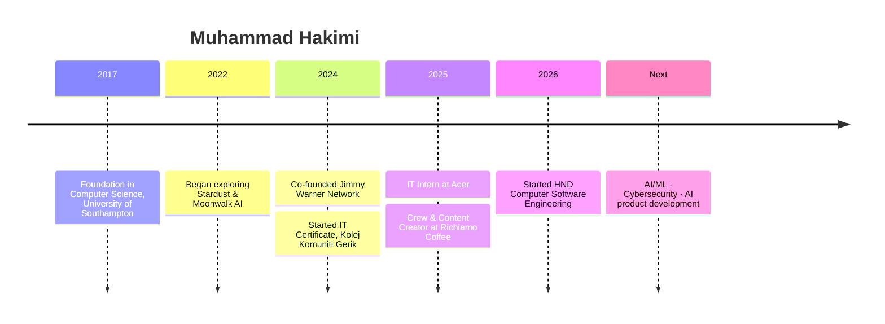

<div align="center">

<table>
<tr>
<td align="center"><br><sub><b>THEN</b> · always curious</sub></td>
<td align="center"><br><sub><b>NOW</b> · still playing, now building</sub></td>
</tr>
</table>

# Muhammad Hakimi

**Co-Founder, Jimmy Warner Network**<br>
*AI · Machine Learning · Cybersecurity · Software Engineering*


<a href="https://www.linkedin.com/in/muhammad-hakimi-b7a906297"></a>
<a href="https://github.com/JimmyWarner9"></a>
<a href="https://jimmywarner9.github.io/Bilik-Digital-360/"></a>

</div>

---

## ✦ Founder's Note

> I build intelligent software that solves real problems, from an idea, to research, to design, to a product people actually use.

My long-term direction sits where **AI, cybersecurity, and software engineering** meet: products that can detect, automate, and respond.

---

## ✦ The Venture

| | |
|---|---|
| **Company** | Jimmy Warner Network, Co-Founder (Aug 2024 – Present) |
| **Focus** | AI products · Machine learning · Cybersecurity · Automation · Digital products |
| **Studying** | HND Computer Software Engineering, Ungku Omar Polytechnic (2026–2028) |
| **Open to** | AI/ML roles · Startup collaborations · Security projects · Open source · Research |

---

## ✦ Selected Work

| Project | What it is | Stack |
|---|---|---|
| **[360° Digital Room](https://jimmywarner9.github.io/Bilik-Digital-360/)** | Browser-based immersive room with hotspots, popups and navigation | Pano2VR · HTML5 · Canva |
| **[Pakdin Dalca](https://github.com/JimmyWarner9/pakdindalca)** | Restaurant site with menu, catering, cart and WhatsApp ordering | HTML · CSS · JS |
| **[Carmila Cafe](https://github.com/JimmyWarner9/CarmilaCafe)** | Brand-focused cafe website | HTML · CSS · JS |
| **[AI Startup Investor Page](https://github.com/JimmyWarner9/ai-startup-investor-page)** | Investor-facing landing page for an AI startup concept | HTML · CSS |
| **Stardust & Moonwalk AI** | Exploring ML, game AI and intelligent systems | Python · ML · Data Science |

---

## ✦ Capabilities

<p>

</p>

```text
AI / ML        →  PyTorch · Data Modeling · Computer Vision · Game AI · Automation
Security       →  Network Security · Threat Detection · Security Automation · Secure Development
Software       →  Django · JavaScript · C / C++ · Responsive Web
Cloud & Tools  →  AWS · Git · GitHub · IntelliJ IDEA · Laragon
```

---

## ✦ Journey



---

## ✦ Philosophy

<div align="center">

**Learn → Build → Break → Fix → Improve → Ship → Repeat**

</div>

---

<div align="center">

### Let's build something worth shipping.

<a href="https://www.linkedin.com/in/muhammad-hakimi-b7a906297"></a>
<a href="https://github.com/JimmyWarner9"></a>


<a href="https://open.spotify.com/playlist/37i9dQZF1E4oee5QSbfqLN"></a>


</div>
